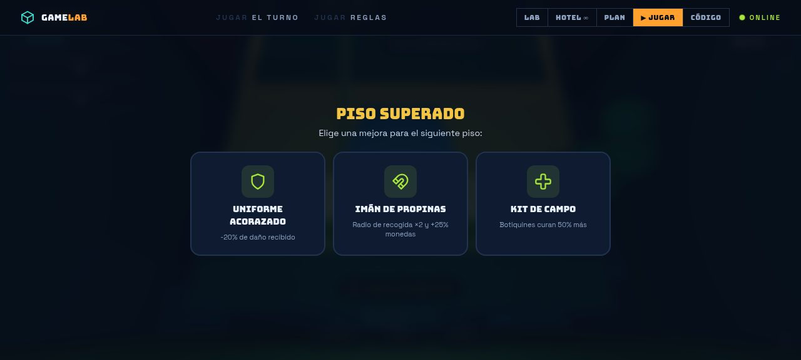
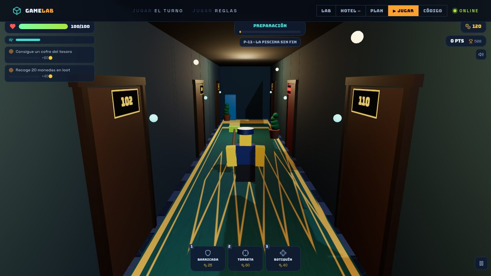

<div align="center">

# 🎮 Roblox Game Lab

### Hotel ∞ Infinito — GDD completo + 3 conceptos de juego para Roblox

*Sitio interactivo de investigación y diseño: radiografía del mercado Roblox 2025, tres conceptos jugables en nichos vacíos, GDD completo del proyecto estrella, roadmap de producción y código Luau de referencia.*

[](https://github.com/eddyflores100-lang/hotelmaldito/actions/workflows/ci.yml)
[](https://github.com/eddyflores100-lang/hotelmaldito/actions/workflows/deploy-pages.yml)
[](https://www.typescriptlang.org/)
[](https://react.dev/)
[](https://vite.dev/)
[](LICENSE)

**🌐 Ver demo en vivo → [eddyflores100-lang.github.io/hotelmaldito](https://eddyflores100-lang.github.io/hotelmaldito/)**

</div>

---

## 🎮 JUEGO JUGABLE 3D — HOTEL ∞: NOCHE INFINITA (action-survival)

**El juego ya se juega dentro del sitio.** Pulsa **▶ JUGAR** (es la vista principal) y sobrevive la noche como botones del Hotel ∞: explora habitaciones, saquea monedas, **construye defensas** y aguanta **3 oleadas de anomalías** por noche. Al superar cada piso, elige 1 de 3 mejoras roguelite y sube al siguiente piso — **los pisos nunca terminan**.

| | |
|---|---|
|  |  |
| *Oleada nocturna en el P-13 — pasillo, puertas y anomalías* | *Al superar un piso: elige 1 de 3 mejoras* |
|  |  |
| *Fase de día: saquea y construye* | *Joystick + botones táctiles en móvil* |

**El loop completo (60–90 s por piso):**

1. 🏗️ **FASE DE DÍA (45 s)** — explora las 8 habitaciones del piso, rompe candados con la **llave-tarjeta**, saquea monedas/botiquines/cofres y **construye defensas**: barricadas de maletas (25 🪙), torretas automáticas (60 🪙) y estaciones de curación (40 🪙).
2. 🌙 **NOCHE — 3 OLEADAS** — las anomalías emergen del ascensor y de las habitaciones sin explorar: **Sombra** (tanque lento), **Maleta** (veloz), **Altísimo** (largo alcance), **Fantasma** (atraviesa muros y barricadas) y cada 3 pisos… **EL GERENTE** (jefe que destroza puertas y barricadas).
3. ⚔️ **COMBATE** — golpe de escoba con arco y knockback (`clic`/`J`), dash con invulnerabilidad (`Shift`), combos ×8 que multiplican puntos, torretas que cubren tus espaldas.
4. 📋 **MISIONES DINÁMICAS** — 2 misiones activas por piso (explora, saquea, construye, derrota) con recompensas en monedas.
5. 🎴 **MEJORAS ROGUELITE** — al llegar las 6:00 AM: +daño, +vida, torretas pro, imán de monedas, botas de bruma… elige tu build y sube de piso.

**Controles:** `WASD` mover · ratón cámara · `clic`/`J` golpear · `Shift` dash · `Espacio` saltar · `E` puertas/cofres/ascensor · `1·2·3` construir · `Q` cancelar · `P` pausa. **Móvil:** joystick + botones + barra de construcción.

**Bajo el capó:** motor propio sobre [Three.js](https://threejs.org/) (~3.400 líneas de TypeScript en `src/game/`): generador procedural de pisos con habitaciones reales (`world.ts`), 5 enemigos con IA de navegación por zonas y rutas por puertas (`enemy.ts`), construcciones colocables con validación de rejilla (`builds.ts`), director de oleadas con jefes, sistema de misiones por eventos (`missions.ts`), mejoras roguelite, cámara 3ª persona con raycast anti-muros, partículas, daño flotante, screen-shake, iluminación día/noche dinámica, audio 100% sintetizado con WebAudio (sin assets) y récord guardado en `localStorage`.

> La demo demuestra el loop de acción descrito en el GDD. El juego completo vive en Roblox Studio — el código Luau de referencia está en la vista CÓDIGO.

## 📖 Sobre el proyecto

**Roblox Game Lab** es un documento interactivo de preproducción para crear juegos *únicos para niños y adolescentes en Roblox*. En lugar de copiar fórmulas de moda, este laboratorio analiza los datos reales del mercado (Q3–Q4 2025), identifica **nichos vacíos** y propone tres conceptos completos con su loop de juego, escenarios, monetización y referencias.

El concepto ganador — **Hotel ∞ Infinito**, terror cómico cooperativo con pisos procedurales infinitos — cuenta con un **GDD (Game Design Document) completo**: pilares de diseño, roles jugables, economía de propinas, generador de pisos, integración técnica en Roblox Studio y plan de live-ops.

> ⚠️ Proyecto conceptual no oficial, sin afiliación con Roblox Corporation. Cifras de mercado tomadas de reportes públicos (2025).

## 📸 Vista previa

| | |
|---|---|
|  |  |
| *Landing — «Tres juegos que aún no existen»* | *Radiografía del mercado con métricas animadas* |
|  |  |
| *GDD completo — Hotel ∞ Infinito* | *Referencia técnica Luau con resaltado propio* |

## ✨ Qué incluye

| Vista | Contenido |
|---|---|
| 🔬 **LAB** | Radiografía del mercado con métricas animadas, 5 insights de diseño, 3 conceptos con loop y escenarios, tabla comparativa y veredicto razonado |
| 🏨 **HOTEL ∞** | GDD completo: pilares, roles, economia de propinas, escenarios firma (Piscina Sin Fin, Piso Espejo, La Caldera), sistemas y UI |
| 🗺️ **PLAN** | Roadmap de 12 semanas en 4 fases: prototipo vertical → generador procedural → beta cerrada → lanzamiento y live-ops |
| 🎮 **JUGAR** | Demo 3D jugable del turno de noche: recepción en 3ª persona, huéspedes con anomalías, fichas de registro y pisos infinitos |
| 💻 **CÓDIGO** | Referencia técnica en Luau: arquitectura cliente/servidor, sistema de gráficos y patrón de generación procedural |

## 🧩 Los tres conceptos

| # | Concepto | Género | Nicho | Potencial viral |
|---|---|---|---|---|
| 01 | **Chatarra Cósmica** | Tycoon físico en gravedad cero | Vacío en Roblox | ● ● ○ |
| 02 | **Hotel ∞ Infinito** ⭐ | Terror cómico procedural co-op | Dores adultos → 13+ | ● ● ● |
| 03 | **Hormiguero: Guerra del Jardín** | Estrategia de colonias macro | Escala micro sin explotar | ● ● ○ |

**Veredicto del laboratorio:** *Hotel ∞ Infinito* — riesgo bajo con techo altísimo, contenido infinito por diseño (un piso nuevo cada 2 semanas sin mapear a mano) y encaje perfecto con la demográfica 13+ que Roblox está empujando.

## 🛠️ Stack tecnológico

| Tecnología | Uso |
|---|---|
| [React 18](https://react.dev/) + [TypeScript 5](https://www.typescriptlang.org/) | UI declarativa con tipado estricto |
| [Three.js](https://threejs.org/) | Motor 3D de la demo jugable (avatares, hotel, luces y sombras) |
| [Vite 6](https://vite.dev/) | Dev server y build de producción |
| [Tailwind CSS 4](https://tailwindcss.com/) | Sistema de diseño con tokens (`@theme`) |
| Lucide React | Iconografía |
| WebAudio API | Audio de la demo 100% sintetizado, sin assets |
| IntersectionObserver API | Animaciones scroll-reveal y contadores (sin dependencias externas) |
| CSS keyframes propios | Marquee, flotación, scan-sweep, reveals — respetando `prefers-reduced-motion` |

## 🚀 Empezar

### Requisitos

- [Node.js](https://nodejs.org/) ≥ 20 o [Bun](https://bun.sh/) ≥ 1.1

### Instalación

```bash
# Clona el repositorio
git clone https://github.com/eddyflores100-lang/hotelmaldito.git
cd hotelmaldito

# Instala dependencias
bun install        # o: npm install
```

### Desarrollo

```bash
bun run dev        # http://localhost:3000
```

### Producción

```bash
bun run build      # genera dist/ (usa BASE_PATH si despliegas en subcarpeta)
bun run preview    # sirve el build localmente
bun run typecheck  # verificación de tipos
```

## 📦 Despliegue

### GitHub Pages (automático)

El repo incluye un workflow que despliega a **GitHub Pages** en cada push a `main`:

1. Ve a **Settings → Pages** en tu repositorio.
2. En **Source**, selecciona **GitHub Actions**.
3. Haz push a `main` — el sitio quedará en `https://<usuario>.github.io/hotelmaldito/`.

El workflow compila con `BASE_PATH=/<repo>/` automáticamente, así que no hay que tocar nada.

### Otras plataformas (Vercel, Netlify…)

Build estático puro: comando `bun run build`, directorio de salida `dist/`, base `/`. Sin configuración extra.

## 🗂️ Estructura del proyecto

```
hotelmaldito/
├── .github/workflows/     # CI (typecheck+build) y deploy a Pages
├── public/                # favicon, robots.txt, og-image
├── src/
│   ├── components/        # Vistas: Gdd, Roadmap, Codebase + iconos SVG propios
│   ├── data/              # Contenido: concepts, gdd, roadmap, codebase (Luau)
│   ├── App.tsx            # Shell SPA: navegación LAB / HOTEL∞ / PLAN / CÓDIGO
│   ├── hooks.ts           # useInView, useCountUp
│   ├── index.css          # Tema Tailwind 4 + animaciones propias
│   └── main.tsx           # Entry point
├── index.html             # Meta SEO + Open Graph + fuentes
└── vite.config.js         # Base path configurable + preview
```

**Punto clave de la arquitectura:** todo el contenido (conceptos, GDD, roadmap, snippets) vive en `src/data/` como TypeScript tipado — editar el documento no toca ningún componente.

## 🤝 Contribuir

Las contribuciones son bienvenidas, especialmente al GDD y a los conceptos de juego:

1. Haz fork del repo y crea tu rama: `git checkout -b feature/nueva-idea`
2. Edita los datos en `src/data/` (tipados, autocompletado garantizado)
3. Verifica localmente: `bun run typecheck && bun run build`
4. Abre un Pull Request describiendo la mejora

Consulta [CONTRIBUTING.md](CONTRIBUTING.md) para las convenciones de commits y estilo de código.

## 📄 Licencia

Distribuido bajo la [Licencia Apache 2.0](LICENSE).

---

<div align="center">
<sub>Hecho con 🧡 y mucho café de madrugada · turno de noche en el Hotel ∞</sub>
</div>
